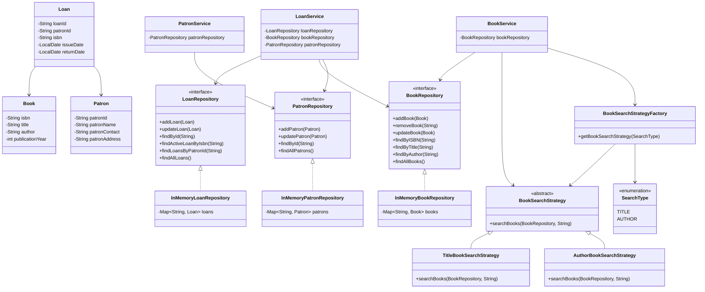

# Library Management System

A Java-based in-memory Library Management System designed to demonstrate
Object-Oriented Programming, SOLID principles, Java Collections, design
patterns, custom exception handling, defensive copying, and logging.

The system supports book management, patron management, lending operations,
inventory availability, and borrowing history.

The application does not use a database or external API. All data is stored
in memory using Java Collections.

---

## 1. Problem Statement

The objective of this project is to build a Library Management System that
allows a library to:

- Manage books
- Manage patrons
- Search for books
- Lend books to patrons
- Return borrowed books
- Track book availability
- Track patron borrowing history
- Prevent invalid lending operations
- Maintain a clean separation between business logic and data storage

The implementation focuses on the mandatory requirements of the assignment
while keeping the architecture extensible for future features such as
reservations, notifications, multiple branches, and recommendations.

---

## 2. Features

### Book Management

The system supports:

- Adding books
- Removing books
- Updating book information
- Finding a book by ISBN
- Searching books by title
- Searching books by author
- Viewing all books

Each book contains:

- ISBN
- Title
- Author
- Publication year

ISBN is treated as the unique identity of a book.

---

### Patron Management

The system supports:

- Adding patrons
- Updating patron information
- Finding a patron by ID
- Viewing all patrons
- Tracking borrowing history through loan records

Each patron contains:

- Patron ID
- Name
- Contact information
- Address

Patron IDs are generated automatically.

---

### Lending Management

The system supports:

- Checking out a book
- Returning a book
- Checking whether a book is available
- Preventing checkout of an already borrowed book
- Preventing return of an already returned loan
- Tracking borrowing history for a patron

A loan represents the temporary relationship between a patron and a
borrowed book.

Each loan contains:

- Loan ID
- Patron ID
- ISBN
- Issue date
- Return date

A `null` return date represents an active loan.

---

### Inventory Management

Book availability is derived from loan records instead of being stored as
an independent boolean property on `Book`.

A book is:

- **Available** when there is no active loan for its ISBN.
- **Borrowed** when an active loan exists for its ISBN.

This avoids maintaining two independent sources of truth.

For example:

```text
Book
  ISBN: 978-001

        |
        v

Loan records

Loan 1 -> returned
Loan 2 -> active
Loan 3 -> returned

        |
        v

Book is currently BORROWED
```

## 3. Architecture
The application follows a layered architecture:
```text
                         +----------------+
                         |      Main      |
                         +-------+--------+
                                 |
                                 v
                    +------------------------+
                    |       Services         |
                    +-----------+------------+
                                |
                +---------------+---------------+
                |               |               |
                v               v               v
          BookService     PatronService    LoanService
                |               |               |
                +---------------+---------------+
                                |
                                v
                    +------------------------+
                    |     Repositories       |
                    +-----------+------------+
                                |
                                v
                    +------------------------+
                    | In-Memory Implementations|
                    +-----------+------------+
                                |
                                v
                    +------------------------+
                    |     Domain Models      |
                    +------------------------+
```

The main responsibilities of each layer are:

### Models

Represent the core domain entities and their state.
 - `Book`
 - `Patron`
 - `Loan`


### Repositories

Responsible for storing and retrieving domain objects.

Repository interfaces:
 - `BookRepository`
 - `PatronRepository`
 - `LoanRepository`

In-memory implementations:
 - `InMemoryBookRepository`
 - `InMemoryPatronRepository`
 - `InMemoryLoanRepository`

Services

Contain application and business logic.
 - `BookService`
 - `PatronService`
 - `LoanService`

Services depend on repository interfaces rather than concrete repository
implementations.

## 4. Package Structure
```text
src/
├── enums/
│   └── SearchType.java
│
├── exceptions/
│   ├── BookAlreadyBorrowedException.java
│   ├── BookAlreadyReturnedException.java
│   ├── BookNotFoundException.java
│   ├── DuplicateBookException.java
│   ├── DuplicatePatronException.java
│   ├── InvalidSearchStrategy.java
│   ├── LoanNotFoundException.java
│   └── PatronNotFoundException.java
│
├── factory/
│   └── BookSearchStrategyFactory.java
│
├── models/
│   ├── Book.java
│   ├── Loan.java
│   └── Patron.java
│
├── repository/
│   ├── BookRepository.java
│   ├── InMemoryBookRepository.java
│   ├── LoanRepository.java
│   ├── InMemoryLoanRepository.java
│   ├── PatronRepository.java
│   └── InMemoryPatronRepository.java
│
├── service/
│   ├── BookService.java
│   ├── LoanService.java
│   └── PatronService.java
│
├── strategy/
│   ├── AuthorBookSearchStrategy.java
│   ├── BookSearchStrategy.java
│   └── TitleBookSearchStrategy.java
│
└── Main.java
```

## 5. Domain Model

The system contains three primary domain entities:

```
+------------------+
|      Book        |
+------------------+
| isbn             |
| title            |
| author           |
| publicationYear  |
+------------------+

+------------------+
|     Patron       |
+------------------+
| patronId         |
| patronName       |
| patronContact    |
| patronAddress    |
+------------------+

+------------------+
|      Loan        |
+------------------+
| loanId           |
| patronId         |
| isbn             |
| issueDate        |
| returnDate       |
+------------------+
```
----
### Book

`Book` represents a book available in the library.

The ISBN is treated as the unique identity of a book and is immutable after
creation.

The other book information can be updated.

----

### Patron

`Patron` represents a library member.

A unique patron ID is generated when the patron is created.

Patron information such as name, contact information, and address can be
updated.

----

### Loan

`Loan` represents a borrowing transaction.

Instead of storing a direct reference to a `Book` or `Patron`, the loan stores
their identifiers:

````
Loan
|
+-- patronId
|
+-- isbn
|
+-- issueDate
|
+-- returnDate

````
This keeps the loan record lightweight and allows repositories to remain
independent.

A loan can be viewed as:

````
Patron ---- borrows ----> Book
|
v
Loan
````

The relationship is conceptual; the Java `Loan` class stores the
corresponding `patronId` and `isbn`.

----

### 6. Lending Model

The lending model is intentionally based on loan records.

A book can have multiple loans over its lifetime:

````
Book
|
+-- Loan 1 -> returned
|
+-- Loan 2 -> returned
|
+-- Loan 3 -> active
````

At any point in time, a book can have at most one active loan.

An active loan is identified by:

````
returnDate == null
````

A returned loan has:
````
returnDate != null
````
This means that the loan history itself contains enough information to
determine the current state of a book.

----

### 7. Borrowing History

Borrowing history is derived from the loan repository.

For a patron:
````
Patron
|
+-- Loan 1 -> returned
|
+-- Loan 2 -> returned
|
+-- Loan 3 -> active
````
All loans associated with the patron's ID represent that patron's borrowing
history.

The `Patron` entity therefore does not maintain its own `List<Loan>`.

This avoids duplicating the same relationship in multiple places.

----

### 8. Why Loan Is a Separate Entity

A loan is modeled as a separate domain entity because borrowing is a
relationship that has its own information.

The relationship contains:

 - Which patron borrowed the book
 - Which book was borrowed
 - When it was issued
 - When it was returned

If this information were stored directly inside `Book` or `Patron`, it would
become difficult to represent historical transactions.

For example:
````
Book
|
+-- current patron
````
would only represent the current borrower.

Using `Loan` allows:

````
Book
|
+-- Loan 1 -> Patron A -> returned
+-- Loan 2 -> Patron B -> returned
+-- Loan 3 -> Patron C -> active
````

Therefore, `Loan` acts as the transaction/history entity of the system.

9. Repository Layer

Repositories abstract data storage from the rest of the application.

The system defines repository interfaces:
````
BookRepository
PatronRepository
LoanRepository
````
and provides in-memory implementations:
````
InMemoryBookRepository
InMemoryPatronRepository
InMemoryLoanRepository
````
This creates a dependency structure like:
````
BookService
|
v
BookRepository
^
|
InMemoryBookRepository
````

The service does not need to know how books are actually stored.

----

### 10. In-Memory Storage

The repositories use Java `HashMap` collections.
````
BookRepository
|
v
Map<String, Book>
|
+-- ISBN -> Book
````
````
PatronRepository
|
v
Map<String, Patron>
|
+-- Patron ID -> Patron
````
````
LoanRepository
|
v
Map<String, Loan>
|
+-- Loan ID -> Loan
````
Using identifiers as map keys provides efficient direct lookup for books,
patrons, and loans.

Operations such as searching by title, author, patron history, or active
loan require traversing the stored values and are therefore linear in the
number of records.

Since this is an in-memory assignment without a database or large-scale
dataset, this approach is appropriate for the current scope.

----

### 11. Defensive Copying

The in-memory repositories use defensive copies when storing and returning
domain objects.

For example:
````
Caller
|
v
Book object
|
v
Repository
|
v
copy of Book
````
When a repository returns a book, it returns another copy rather than
exposing the internal object stored inside its map.

This prevents callers from directly modifying repository state.

Therefore, state changes should go through the appropriate service or
repository operation.

For example:
````
BookService
|
v
BookRepository.updateBook()
````

instead of:
````
Book object obtained from repository
|
v
directly mutate internal repository state
````
This strengthens encapsulation.

----

## 12. Service Layer

The service layer contains business rules.

### BookService
Responsible for:

 - Adding books
 - Preventing duplicate ISBNs
 - Removing books
 - Updating books
 - Finding books by ISBN
 - Searching by title
 - Searching by author
 - Returning all books
----

### PatronService
Responsible for:

 - Adding patrons
 - Preventing duplicate patron IDs
 - Updating patron information
 - Finding patrons
 - Returning all patrons
----

### LoanService
Responsible for:

 - Validating patron existence
 - Validating book existence
 - Checking whether a book is already borrowed 
 - Creating loans
 - Returning books
 - Preventing duplicate returns
 - Checking book availability
 - Retrieving patron borrowing history

The lending business rules are therefore kept out of the repository layer.

----

## 13. Dependency Injection

Services receive repository dependencies through their constructors.

For example:
````
BookService(BookRepository)
PatronService(PatronRepository)
LoanService(LoanRepository, BookRepository, PatronRepository)
````

This is constructor-based dependency injection.

The service depends on an abstraction:
````
BookService
|
v
BookRepository
````
rather than a concrete implementation:
````
BookService
|
X
InMemoryBookRepository
````
This makes it possible to replace the in-memory repository with another
implementation later without changing the service logic.

For example, a future implementation could use:
````
DatabaseBookRepository
````
while still implementing:
````
BookRepository
````

## 14. Design Patterns

The project implements two design patterns:

1. Strategy Pattern
2. Factory Pattern

----

### 14.1 Strategy Pattern

The Strategy pattern is used for book searching.

Different search operations have different behaviors:
````
Search by title
Search by author
````

Instead of placing all search behavior directly inside `BookService`, the
system defines:
````
BookSearchStrategy
````
with concrete implementations:
````
TitleBookSearchStrategy
AuthorBookSearchStrategy
````
Structure:
````
                    BookSearchStrategy
                           |
              +------------+------------+
              |                         |
              v                         v
TitleBookSearchStrategy    AuthorBookSearchStrategy
````

Each strategy delegates to the corresponding repository operation.

The benefit is that search behavior can vary independently from
`BookService`.

For example, additional strategies could be introduced later:
````
ISBNBookSearchStrategy
PublicationYearSearchStrategy
KeywordBookSearchStrategy
````

without putting all search algorithms into one large service class.

----

### 14.2 Factory Pattern

The Factory pattern is used to create the appropriate search strategy.

`BookSearchStrategyFactory` receives a `SearchType`:
````
SearchType.TITLE
SearchType.AUTHOR
````

and creates the appropriate implementation.
````
                    BookService
                         |
                         v
             BookSearchStrategyFactory
                         |
             +-----------+-----------+
             |                       |
          TITLE                    AUTHOR
             |                       |
             v                       v
      TitleStrategy           AuthorStrategy
````

This separates object creation from the business logic that uses the
strategy.

`BookService` only needs to work with:
````
BookSearchStrategy
````
and does not need to manually construct each concrete strategy.

----

## 15. OOP Principles

The project demonstrates the four major Object-Oriented Programming
principles.

----

#### Encapsulation

Domain state is encapsulated using private fields.

For example:
````
Book
|
+-- private isbn
+-- private title
+-- private author
+-- private publicationYear
````

State is accessed through methods rather than exposing fields directly.

The `Loan` entity provides controlled mutation of `returnDate`, while
identity-related properties remain immutable.

---- 

### Abstraction

Repository interfaces abstract the storage mechanism:
````
BookRepository
PatronRepository
LoanRepository
````
Consumers work with these interfaces without knowing whether the data is
stored in a `HashMap`, database, or some other storage system.

`BookSearchStrategy` also provides an abstraction for search behavior.

----

### Inheritance

Concrete search strategies inherit from the abstract base class:
````
BookSearchStrategy
|
+-- TitleBookSearchStrategy
|
+-- AuthorBookSearchStrategy
````
The common contract is defined in the parent class.

----

### Polymorphism

The factory returns the common abstraction:
````
BookSearchStrategy
````
The actual runtime object can be:
````
TitleBookSearchStrategy
````
or:
````
AuthorBookSearchStrategy
````
The service can therefore use the common interface without depending on the
specific implementation.

----

## 16. SOLID Principles

The design applies the SOLID principles as follows.

----

### Single Responsibility Principle

Different classes have different responsibilities.
````
Models       -> represent domain state
Repositories -> store/retrieve data
Services     -> business logic
Strategies   -> search behavior
Factory      -> strategy creation
````
For example, `LoanService` handles lending rules but does not directly manage
the internal `HashMap` used by `LoanRepository`.

-----

### Open/Closed Principle

The search system can be extended by adding new strategy implementations.

For example:
````
BookSearchStrategy
|
+-- TitleBookSearchStrategy
+-- AuthorBookSearchStrategy
+-- ISBNBookSearchStrategy
+-- KeywordBookSearchStrategy
````
Existing strategy implementations do not need to be modified when a new
strategy is introduced.

----

### Liskov Substitution Principle

Concrete search strategies can be used anywhere a
`BookSearchStrategy` is expected.

For example:
````
BookSearchStrategy strategy;

strategy = new TitleBookSearchStrategy();
````
or:
````
strategy = new AuthorBookSearchStrategy();
````
Both implementations satisfy the contract defined by the abstraction.

----

### Interface Segregation Principle

The repository interfaces are separated according to their domain
responsibilities.

Instead of having one large repository interface such as:
````
LibraryRepository
````
the system has:
````
BookRepository
PatronRepository
LoanRepository
````
Classes therefore depend only on the operations relevant to the entity they
work with.

----

### Dependency Inversion Principle

The service layer depends on repository abstractions:
````
BookService
|
v
BookRepository
````
rather than concrete implementations:
````
BookService
|
v
InMemoryBookRepository
````
This allows the underlying storage implementation to be replaced without
changing the service layer.

----

## 17. Error Handling

Custom exceptions are used to represent important business and lookup
failures.

The project includes:
````
BookNotFoundException
PatronNotFoundException
LoanNotFoundException

DuplicateBookException
DuplicatePatronException

BookAlreadyBorrowedException
BookAlreadyReturnedException

InvalidSearchStrategy
````
Examples:

### Duplicate Book

Attempting to add a book with an existing ISBN results in:
````
DuplicateBookException
````

### Missing Book

Attempting to find or update a non-existent ISBN results in:
````
BookNotFoundException
````

### Already Borrowed Book

Attempting to checkout a book that currently has an active loan results in:
````
BookAlreadyBorrowedException
````

### Already Returned Loan

Attempting to return the same loan twice results in:
````
BookAlreadyReturnedException
````
This makes business failures explicit instead of silently ignoring invalid
operations.

----

## 18. Optional and Exception-Based Lookups

The repository uses `Optional<Loan>` when searching for an active loan.

The reason is that an active loan may legitimately exist or not exist.

Therefore:
````
Optional.empty()
````
means:
````
No active loan exists
````
which indicates that the book is available.

This is different from operations such as:
````
findByISBN()
findById()
````
where a requested entity is expected to exist and a missing entity represents
an error, so a custom exception is used.

----

## 19. Book Availability Logic

Book availability is calculated using the loan repository.

The logic is:
````
Is the book present?
|
v
Does an active loan exist?
|
/   \
YES    NO
|      |
v      v
BORROWED AVAILABLE
````
In logical terms:
````
book exists
AND
no active loan exists for that ISBN
````
This means availability is not duplicated as a separate field on `Book`.

----

## 20. Important Business Rules

The system enforces the following rules:

### Rule 1 — ISBN uniqueness

Two books cannot be added with the same ISBN.

### Rule 2 — Patron ID uniqueness

Two patrons cannot be added with the same patron ID.

### Rule 3 — Existing patron required for checkout

A checkout operation fails if the patron does not exist.

### Rule 4 — Existing book required for checkout

A checkout operation fails if the book does not exist.

### Rule 5 — One active loan per book

A book cannot be checked out while another active loan exists for that ISBN.

### Rule 6 — Returned loan cannot be returned again

A loan whose returnDate is already set cannot be returned again.

### Rule 7 — Availability follows loan state

A book becomes unavailable when an active loan is created and available again
when that loan is returned.

### Rule 8 — Borrowing history comes from loans

All loans belonging to a patron represent that patron's borrowing history.

----

## 21. Java Collections

The application uses Java Collections for in-memory storage and result
handling.

Primary data structures:
````
HashMap<String, Book>
HashMap<String, Patron>
HashMap<String, Loan>
````
Maps are appropriate because books, patrons, and loans have unique
identifiers.

Lists are used when returning collections of:

 - Books matching a title
 - Books matching an author
 - All books
 - All patrons
 - Patron borrowing history
 - All loans

`Optional` is used for active-loan lookup.

----

## 22. Logging

The application uses Java's built-in:
````
java.util.logging
````
Important service operations are logged, including:

 - Book addition
 - Book removal
 - Patron addition
 - Book checkout
 - Book return

Example:
````
INFO: Book with ISBN ... was added successfully
INFO: Patron with ID ... was added successfully
INFO: Book with ISBN ... checked out successfully
INFO: Book with ISBN ... returned successfully
````
Logging provides visibility into important business operations without mixing
logging concerns into the repository layer.

## 23. Testing and Validation

The `Main` class contains demonstration and validation scenarios covering
both successful operations and invalid operations.

The application was tested for:

### Normal Operations
 - Adding books
 - Adding patrons
 - Searching books
 - Checking availability
 - Checking out books
 - Returning books
 - Viewing borrowing history

### Invalid Operations
 - Searching for a non-existent title
 - Searching for a non-existent author
 - Finding a non-existent ISBN
 - Checking out a non-existent book
 - Checking out for a non-existent patron
 - Updating a non-existent book
 - Updating a non-existent patron
 - Returning a non-existent loan
 - Adding a duplicate book
 - Adding a duplicate patron
 - Checking out an already borrowed book
 - Returning an already returned loan

All tested scenarios completed successfully.

## 24. Example Flow

A typical lending flow looks like this:
````
1. Create Book
   |
   v
2. Add Book
   |
   v
3. Create Patron
   |
   v
4. Add Patron
   |
   v
5. Check Book Availability
   |
   v
   AVAILABLE
   |
   v
6. Checkout Book
   |
   v
7. Loan Created
   |
   v
   BORROWED
   |
   v
8. Return Loan
   |
   v
9. returnDate populated
   |
   v
   AVAILABLE
````

## 25. Class Diagram

The following class diagram represents the main domain classes,
repositories, services, and search strategy components.




Note: The `Loan` to `Book` and `Loan` to `Patron` relationships in the
conceptual diagram are represented through `isbn` and `patronId`
respectively. The Java `Loan` class does not hold direct object references
to `Book` or `Patron`.

----

## 26. Design Decisions
### Why no `available` field in Book?

Availability can be derived from the loan records.

Keeping both:
````
Book.available
````
and:
````
Loan.returnDate
````
would create two possible sources of truth.

For example, one could indicate that a book is available while the other
indicates that it is borrowed.

Therefore, availability is derived from active loans.

----

### Why no borrowing history list inside Patron?

Borrowing history already exists in the loan repository.

Maintaining:
````
Patron -> List<Loan>
````
in addition to:
````
LoanRepository -> Loan records
````
would duplicate relationship data.

Instead, the borrowing history is retrieved from the loan repository using
the patron ID.

----

### Why does Loan store IDs instead of objects?

`Loan` stores:
````
patronId
isbn
````
rather than:
````
Patron
Book
````
This keeps the entities loosely coupled and makes the loan record a
self-contained transaction record.

----

### Why does LoanService depend on repositories directly?

Lending logic needs to validate both:
````
Book exists
Patron exists
````
and manage:
````
Loan state
````
Therefore, `LoanService` directly depends on the three relevant repository
abstractions.

This avoids unnecessary service-to-service dependencies and keeps the
responsibility for lending in one place.

----

## 27. Future Enhancements

The current implementation intentionally focuses on the mandatory assignment
requirements.

The architecture can be extended with:

### Multi-Branch Library

Support multiple library branches and associate books with individual
branches.

### Book Transfers

Allow books to be transferred between branches.

### Reservations

Allow patrons to reserve books that are currently unavailable.

### Notifications

Notify patrons when a reserved book becomes available or when a loan is
overdue.

### Recommendation System

Recommend books based on patron borrowing history.

### Persistent Storage

Replace the in-memory repositories with database-backed implementations.

For example:
````
BookRepository
|
+-- InMemoryBookRepository
|
+-- DatabaseBookRepository
````
The service layer can remain unchanged because it already depends on the
repository abstraction.

### Automated Unit Tests

The current Main class demonstrates and validates application behavior.
A future improvement would be to introduce a dedicated unit-test suite using
a testing framework such as JUnit.

## 28. Limitations

The current system intentionally has the following limitations:

 - Data is lost when the application terminates.
 - Only one library branch is modeled.
 - There is no reservation system.
 - There are no notifications.
 - There is no authentication or authorization.
 - There is no persistent database.
 - There is no external API integration.
 - Search currently supports title and author through the Strategy pattern,
 - while ISBN lookup is handled directly by the repository.
 - The current model treats an ISBN as a unique book identity and does not
separately model multiple physical copies of the same ISBN.

These limitations are intentional because they are outside the mandatory
scope of the current assignment.

----

## 29. How to Run
### Requirements
 - Java Development Kit (JDK)
 - IntelliJ IDEA or another Java IDE

The project does not require:

 - Database
 - External API
 - Maven
 - Gradle

----

### Running from IntelliJ IDEA
1. Open the project in IntelliJ IDEA.
2. Ensure the project is configured with a compatible JDK.
3. Open `Main.java`.
4. Run the `main()` method.

The Main class demonstrates the major functionality of the system and
contains validation scenarios for invalid operations.

## 30. Conclusion

This project demonstrates how a small backend application can be structured
using object-oriented design principles rather than placing all logic inside
a single class.

The main architectural decisions are:
````
Domain Models
|
v
Repositories
|
v
Services
|
v
Application / Main
````
with:
````
Strategy + Factory
````
used for search behavior,
````
Interfaces + Dependency Injection
````
used to decouple services from storage implementations,

and:
````
Loan records
````
used as the source of truth for lending state, availability, and borrowing
history.

The implementation therefore satisfies the mandatory requirements while
leaving clear extension points for future functionality.